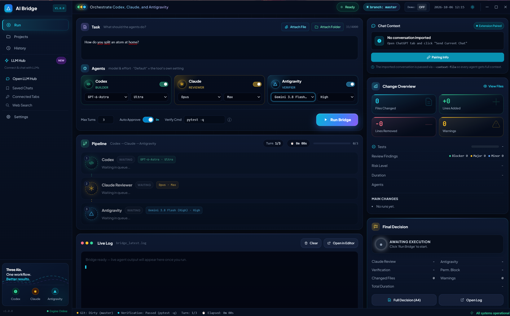
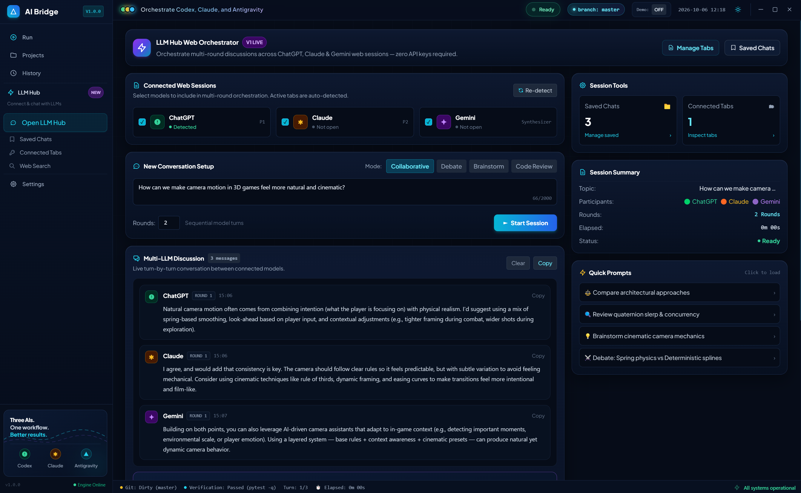

# AI Bridge Studio

> **Three AIs. One workflow. Better results.**
>
> A local desktop workspace for orchestrating coding agents and collaborating across ChatGPT, Claude, and Gemini web sessions.



## What it does

AI Bridge Studio combines two workflows in one Electron desktop app:

- **Coding-agent orchestration** — coordinate OpenAI Codex CLI, Anthropic Claude Code, and Google Antigravity through a guarded review/verification pipeline.
- **LLM Hub** — collaborate across your existing ChatGPT, Claude, and Gemini browser sessions through the included Chrome/Edge companion extension.

The coding pipeline keeps the human in control of the final decision: changes are reviewed and verified before **Accept** or **Rollback** becomes the final action.

## LLM Hub



LLM Hub can run structured multi-model discussions without requiring API keys or per-call API billing. It uses your existing logged-in browser sessions and remains subject to each provider's web-plan usage limits and terms.

Available discussion modes:

- **Collaborative** — constructive synthesis across models.
- **Debate** — critical evaluation, edge cases, and trade-offs.
- **Brainstorm** — non-overlapping creative ideas.
- **Code Review** — implementation-focused technical critique.

A typical session flows like this:

```text
Topic / Task
    ↓
ChatGPT Web
    ↓
Claude Web
    ↓
Gemini Web
    ↓
Additional rounds (optional)
    ↓
Final Consensus
```

LLM Hub also supports provider detection, follow-up questions, saved chats, Markdown/JSON export, connected-tab inspection, and transferring a synthesized result into the coding Run screen.

## Architecture

```text
AI Bridge Studio
│
├── Coding workflow
│   └── Electron UI
│       └── ai_bridge.sh
│           ├── Codex CLI          → Developer
│           ├── Claude Code CLI    → Read-only reviewer
│           └── Antigravity CLI    → Verifier / fixer
│
└── LLM Hub
    └── Electron localhost bridge (127.0.0.1)
        └── Chrome / Edge extension
            ├── ChatGPT Web
            ├── Claude Web
            └── Gemini Web
```

The Electron main process consumes the backend's NDJSON event stream and forwards normalized events to the renderer over IPC. The browser companion communicates only through a localhost bridge and does not read browser cookies or authentication tokens.

## Requirements

- **Windows** (current supported desktop target)
- **Node.js 18+**
- **Git for Windows** with Git Bash
- Optional coding-agent CLIs for live Run execution:
  - `git`
  - `codex`
  - `claude`
  - `agy`
  - `jq`
- **Chrome or Edge** for LLM Hub browser orchestration

You can still inspect the UI and use Demo Mode without configuring all coding CLIs.

## Quick start

Clone the repository and install dependencies:

```bash
git clone https://github.com/webportalim/ai-bridge-studio.git
cd ai-bridge-studio
npm install
```

Launch the desktop app:

```bash
npm start
```

On Windows you can also double-click `start.bat`.

If PowerShell blocks an npm `.ps1` shim, use:

```powershell
npm.cmd start
```

## Browser companion extension

The Manifest V3 companion extension lives in [browser-extension/](browser-extension/).

To install it locally:

1. Open `chrome://extensions` or `edge://extensions`.
2. Enable **Developer mode**.
3. Choose **Load unpacked**.
4. Select the repository's `browser-extension` folder.
5. Start AI Bridge Studio and use **Pair Extension**.
6. Enter the generated one-time pairing code in the extension popup.

The desktop bridge binds to `127.0.0.1:45821`. Pairing uses a short-lived one-time code which is exchanged for a locally stored random token.

### Browser privacy model

The extension is designed to automate only the supported LLM pages and exchange normalized conversation content with the local desktop app. It does **not** intentionally read or store session cookies, browser auth headers, or account passwords.

Because ChatGPT, Claude, and Gemini can change their web DOM at any time, browser adapters may occasionally require updates.

## Coding-agent Run workflow

The Run screen launches the canonical `ai_bridge.sh` backend with machine-readable NDJSON events.

Key safeguards include:

- read-only Claude Code review stage
- verifier/fixer stage after development
- explicit verification command support
- run state persisted under Git metadata
- guarded Accept / Rollback actions
- process-tree cleanup on Stop
- project fingerprint checks before destructive decisions
- human final approval

The backend can also be used directly from Git Bash. Run its built-in help for the current CLI contract:

```bash
./ai_bridge.sh --help
```

## Demo Mode

The desktop app includes a Demo Mode for exploring the interface without spending model usage or modifying a real project. It simulates the pipeline, logs, findings, and decision states.

Demo output is isolated from real LLM Hub sessions and should not be treated as model-generated production output.

## Testing

Install dependencies first, then run the desktop/JavaScript test suites:

```bash
npm test
```

Additional commands:

```bash
npm run test:node
npm run test:electron
```

The shell backend regression suite can be run from Git Bash:

```bash
npm run test:backend
```

To run the backend and desktop suites together in an environment where `bash` is available on `PATH`:

```bash
npm run test:all
```

The repository includes dedicated tests for the backend, browser bridge, frontend integration, file attachments, Electron launch, and LLM Hub orchestration.

## Project structure

```text
ai-bridge-studio/
├── ai_bridge.sh                  # Coding-agent backend orchestrator
├── main.js                       # Electron main process + localhost bridge
├── preload.js                    # Secure contextBridge API
├── package.json
├── start.bat
│
├── renderer/
│   ├── index.html
│   ├── styles.css
│   ├── app.js
│   └── tailwind.min.js
│
├── browser-extension/
│   ├── manifest.json
│   ├── background.js
│   ├── popup.html
│   ├── popup.js
│   ├── popup.css
│   ├── content/
│   │   ├── common.js
│   │   ├── templates.js
│   │   ├── chatgpt.js
│   │   ├── claude.js
│   │   └── gemini.js
│   └── icons/
│
├── docs/
│   ├── GUI_BACKEND_PROTOCOL.md
│   └── screenshots/
│
└── tests/
    ├── test_ai_bridge.sh
    ├── test_attached_files.js
    ├── test_browser_bridge.js
    ├── test_electron_launch.js
    ├── test_frontend_audit.js
    ├── test_llm_orchestration.js
    └── fixtures/
```

## Security notes

- The browser bridge listens on loopback (`127.0.0.1`), not all network interfaces.
- Pairing codes are ephemeral and single-use.
- The companion extension does not require LLM API keys.
- Coding-agent permissions are intentionally separated by role.
- Accept/Rollback are backend-controlled operations rather than arbitrary renderer commands.

If you discover a security-sensitive issue, avoid posting secrets, session data, or credentials in a public issue.

## Status

AI Bridge Studio is under active development. Web-provider automation depends on external page structure, so compatibility can change when providers update their interfaces.

## License

Released under the [MIT License](LICENSE).
